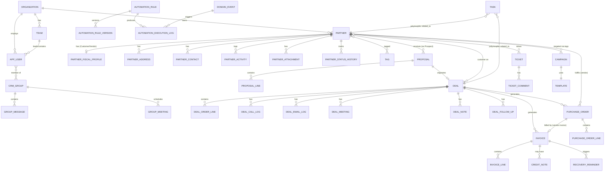

# CRM Backend — Implementation Plan (Java / Spring Boot)

> Companion backend for the `crm` (Angular 21, "varyocrm") frontend. This document is build-ready: stack, multi-tenant data model, module breakdown, API surface, security/rate-limiting/query design, Docker setup, and a phased roadmap. It is written to be fed into a `/goal`-style execution loop, so each phase is scoped to be independently buildable and testable.

---

## 0. Decisions Locked In (from stakeholder Q&A, 2026-08-08)

| Question | Decision |
|---|---|
| Multi-tenancy | **Multi-tenant from day one.** Shared schema, `organization_id` on every tenant-scoped table, tenant context resolved from JWT on every request. |
| Lead vs Partner duality | **Frontend is not the source of truth.** Backend gets one clean, normalized `Partner` model (lifecycle: Lead → Prospect → Customer, plus Vendor) with proper history/attachments/activities as related tables — not a copy of the frontend's two-table split. Frontend will be adapted to this schema later. |
| Automation engine | **Bare minimum server-side now.** Persist rules/versions/execution logs and execute a small, safe subset of actions synchronously. Every trigger-worthy event also writes to a `domain_event` outbox table — this is the seam an n8n workflow will consume via webhook later, so no rework needed when automation is upgraded. |
| File storage | **Local filesystem volume**, behind a `FileStorageService` interface so swapping to S3/MinIO later is a one-class change, not a rewrite. |

Everything else below (JWT auth, rate limiting, caching, pagination conventions, entity redesign) is this plan's own best-practice recommendation, since the frontend's mock auth ("any password works") and in-memory-only data model aren't things to replicate.

---

## 1. Tech Stack

| Concern | Choice | Why |
|---|---|---|
| Language / runtime | Java 21, Spring Boot 3.3.x | LTS, virtual threads available for I/O-bound endpoints |
| Web | Spring Web (MVC, servlet stack) | Simpler ops/debugging than WebFlux for a CRUD-heavy CRM; virtual threads (`spring.threads.virtual.enabled=true`) get most of the throughput benefit without reactive complexity |
| Persistence | Spring Data JPA + Hibernate | Repository pattern out of the box, `@EntityGraph`/projections for query control |
| DB | PostgreSQL 16 | JSONB for semi-structured fields (condition groups, preferences), strong indexing, mature |
| Migrations | Flyway | Versioned, reviewable SQL migrations; no auto-DDL in prod |
| Caching / rate limiting | Redis 7 | Backs Bucket4j (distributed rate limiting) and Spring Cache (hot read paths) |
| Rate limiting | Bucket4j + Redis | Token-bucket, works across multiple app instances, per-IP and per-user/tenant limits |
| Security | Spring Security 6 + JJWT | Stateless JWT (access + rotating refresh), BCrypt passwords |
| Mapping | MapStruct | Compile-time entity↔DTO mapping, no reflection cost, easy to review in generated sources |
| Boilerplate | Lombok | `@Getter/@Setter/@Builder` on entities/DTOs only — never on classes with business logic |
| Validation | Jakarta Bean Validation | DTO-level constraints; service-level checks for business invariants (e.g. "can't demote last admin") |
| API docs | springdoc-openapi | Auto-generated OpenAPI 3 + Swagger UI |
| Testing | JUnit 5, Mockito, Testcontainers (Postgres + Redis), REST Assured or MockMvc | Integration tests run against real Postgres/Redis in containers, not H2 |
| Observability | Spring Actuator + Micrometer → Prometheus endpoint, structured JSON logs (Logback) | Needed for "large-scale daily usage" — you can't tune what you can't see |
| Build | Maven (multi-module optional, single module is enough at this size) | Wide tooling support |
| Containerization | Multi-stage Dockerfile → `eclipse-temurin:21-jre-alpine` runtime image | Small image, no build tools in the final layer |
| Orchestration (local/dev) | Docker Compose: `app`, `postgres`, `redis`, `pgadmin` (optional) | One command up |

---

## 2. Architectural Style

**Modular monolith**, package-by-feature (not package-by-layer at the top level), each feature module internally layered:

```
com.bento.crm
├── config/            # security, cache, rate-limit, CORS, OpenAPI, JPA/tenant filter, async
├── common/            # BaseEntity (audit fields), PageResponse<T>, ApiError, GlobalExceptionHandler,
│                       # TenantContext, BusinessNumberService, Permission enum, base mapper utils
├── auth/               # login, refresh, logout, password reset
├── organization/       # tenant/org entity + settings
├── identity/           # User, Team, Group, GroupMessage, GroupMeeting (RBAC + org structure)
├── partner/            # unified Partner (lead/prospect/customer/vendor) + Tag, Attachment, Activity,
│                       # FiscalProfile, Address, Contact, StatusHistory
├── task/                # polymorphic Task engine
├── proposal/            # Proposal, ProposalLine, ProposalTemplate
├── deal/                # Deal, DealOrderLine, DealCallLog/EmailLog/Meeting/Recording/Note/FollowUp
├── purchaseorder/
├── finance/             # Invoice, InvoiceLine, CreditNote, RecoveryReminder
├── ticket/
├── campaign/
├── automation/          # AutomationRule + versions, AutomationExecutionLog, DomainEvent outbox,
│                       # WebhookSubscription + dispatcher
├── notification/
├── analytics/           # dashboard aggregates, customer-360 read endpoint
├── file/                # FileStorageService (local impl now, S3 impl later)
└── audit/                # generic ActivityLog
```

Why modular monolith over microservices: one Postgres instance, one deploy unit, one team — microservices would add network/latency/ops overhead with zero benefit at this stage. Package boundaries keep it splittable later if a module (e.g. automation, once n8n-integrated) genuinely needs to scale independently.

Each module follows: `Controller → Service → Repository`, with `dto/` (request/response records) and `mapper/` (MapStruct interfaces) inside the module. Controllers never touch repositories directly; services never return entities to controllers.

---

## 3. Multi-Tenancy Design

- **Strategy: shared database, shared schema, discriminator column.** Every tenant-scoped table has a non-null `organization_id UUID` column, indexed as the leading column in every composite index (`(organization_id, status, created_at)` etc.) — this keeps tenant data physically colocated per-tenant on disk/index pages, which matters at scale.
- **Enforcement:** Hibernate `@Filter`/`@FilterDef` (`organizationId`) enabled on every tenant-scoped `@Entity` via `BaseTenantEntity`, activated per-request in a `TenantFilterInterceptor` (`OncePerRequestFilter`) that reads `organizationId` out of the validated JWT and enables the Hibernate filter on the current session **before** any repository call executes. No query can accidentally leak cross-tenant rows because the filter is session-level, not per-repository-method.
- **`TenantContext`** — a request-scoped holder (backed by `ThreadLocal`, cleared in a `finally` block by the same filter) exposes `getCurrentOrganizationId()` to services that need it explicitly (e.g. business-number generation, file path namespacing).
- **New-org provisioning:** `POST /api/v1/organizations` (public, rate-limited hard) creates the `Organization` row + the first `User` (role `ADMIN`) in one transaction — this is the SaaS signup path the frontend's mock login never had.
- **Explicitly out of scope for v1:** schema-per-tenant or database-per-tenant. Revisit only if a specific enterprise customer needs hard physical isolation — the shared-schema approach scales to a large number of small/medium tenants without the migration/ops multiplication cost of per-tenant schemas.

---

## 4. Domain Model

The frontend inventory surfaced real problems worth fixing here rather than copying: an `assignedTo`-as-free-text pattern instead of FKs, a `DealStage` enum that illegally absorbs `ProposalStage` values, a `Lead`/`Partner` split with a lossy one-way bridge, base64-in-a-string-column "file uploads," and a missing `CreditNote`. All fixed below.

### 4.1 Entity-Relationship Overview



### 4.2 Core Tables

All tables below implicitly include: `id UUID PK DEFAULT gen_random_uuid()`, `organization_id UUID NOT NULL` (except `organization` itself), `created_at`, `updated_at`, `created_by UUID REFERENCES app_user`, `updated_by UUID REFERENCES app_user` — inherited from `BaseTenantEntity` / Spring Data JPA Auditing (`@CreatedDate`, `@CreatedBy`, etc. via `AuditorAware<UUID>` reading `TenantContext`). Human-readable business numbers (`LEAD-000123`, `ACC-00001`, `INV-2026-000045`) are a **separate indexed column** (`business_number`), generated per-org-per-entity-type by a `BusinessNumberService` backed by a Postgres sequence-per-(org,prefix) table — never the primary key.

#### `organization`
`name`, `logo_url`, `industry`, `timezone`, `fiscal_year_start_month`, `default_currency` (was the frontend's ungoverned global `globalCurrency` signal — now a real org setting), `plan` (`FREE`/`PRO`/`ENTERPRISE`, for future billing), `created_at`.

#### `app_user`
`organization_id`, `email` (unique per org), `password_hash`, `display_name`, `initials`, `avatar_color`, `role` (enum: `ADMIN`,`MANAGER`,`SALESPERSON`,`SUPPORT`,`VIEWER` — kept as a fixed system enum matching the frontend's `CRM_ROLES`, with the permission matrix expressed as `@PreAuthorize` rules server-side, not a DB table, since it's not user-editable today; a `role_override_permissions` JSONB column is left available for a future custom-permissions feature without a schema change), `team_id` (nullable FK), `is_active`, `phone`, `job_title`, `language` (`en`/`fr`/`ar`/`es`), `notify_on_lead_assign`, `notify_on_deal_update`, `notify_on_mention` (bool flags — simple enough to stay columns rather than JSON), `dashboard_kpis` (JSONB array of widget ids), `last_active_at`.

`refresh_token` (separate table): `user_id`, `token_hash`, `expires_at`, `revoked_at`, `replaced_by_token_id` — supports rotation + reuse detection.

#### `team`
`organization_id`, `name`, `department` (`SALES`,`OPERATIONS`,`FINANCE`,`SUPPORT`,`CUSTOM`), `description`, `lead_user_id` FK, `color`. Business rule (service-layer, replicated from frontend): setting `lead_user_id` promotes that user to `MANAGER` if not already `ADMIN`/`MANAGER`; removing a member who is the current lead is rejected until the lead is transferred; at least one active `ADMIN` must always exist per organization.

#### `crm_group`, `group_member` (join), `group_message`, `group_message_read` (join), `group_meeting`, `group_meeting_attendee` (join)
Straightforward normalization of the frontend's array-of-ids fields into proper join tables (`readByUserIds`/`attendeeUserIds` etc.).

#### `partner` — the unified Lead/Prospect/Customer/Vendor entity
`organization_id`, `type` (`LEAD`,`PROSPECT`,`CUSTOMER`,`VENDOR`), `vendor_subtype` (`TRADE`,`NON_TRADE`, nullable, only for `VENDOR`), `name`, `company_name`, `record_type` (`ORGANIZATION`,`INDIVIDUAL`), `email`, `phone`, `city`, `country`, `source` (enum: website/trade-show/LinkedIn/campaign/referral/cold-call/inbound/other), `score` (0-100), `temperature` (`COLD`,`WARM`,`HOT`), `priority` (`LOW`,`MEDIUM`,`HIGH`), `qualification` (`QUALIFIED`,`UNQUALIFIED`,`PENDING`, nullable outside Lead stage), `stage` (single clean funnel-stage enum: `NEW`,`CONTACTED`,`ATTEMPTED_CONTACT`,`MEETING_SCHEDULED`,`QUALIFIED`,`PROPOSAL_SENT`,`CONFIRMED`,`CUSTOMER`,`LOST`,`DISQUALIFIED` — **this single field replaces both the old `Partner.status`-ish concept and `Lead.status`**, since both were the same funnel idea wearing two names), `assigned_to_user_id` FK (normalized — no more free-text names), `owner_id` FK, `converted_from_partner_id` (self-referencing FK, nullable — records Lead→Prospect→Customer lineage in one row's history instead of the frontend's lossy copy-to-a-new-record bridge; a **type change is an UPDATE, not a new row**, matching the original spec's own instruction that conversion is a status change), `estimated_deal_value`, `probability`, `expected_close_date`, `comments`.

Sub-tables (all `partner_id` FK, `organization_id` for filter consistency):
- `partner_address` (was `CustomerAddress`): `address_type` (`REGISTERED_OFFICE`,`DELIVERY`,`WAREHOUSE`,`BILLING`), `street_address`, `industrial_zone`, `postal_code`, `city`, `country`, `is_primary`
- `partner_contact` (was `CustomerPersonnel` + `LeadContact` merged): `full_name`, `job_title`, `mobile`, `email`, `is_primary`, `is_decision_maker`, `is_technical_contact`, `is_finance_contact`
- `partner_fiscal_profile` (was `CustomerCard`'s Moroccan tax fields; 1:1, only present for `CUSTOMER`/`VENDOR`): `account_id` (business number), `erp_account`, `ice`, `if_field`, `rc`, `rc_city`, `tp`, `vat_status` (array/JSONB of enum), `org_type` (`HEADQUARTER`,`SUBSIDIARY`,`BRANCH`), `parent_account_partner_id` (self-ref for corporate hierarchy)
- `partner_activity` (unifies the frontend's ad-hoc call/email/meeting/note timeline entries that today live only on `Lead`): `type` (`CALL`,`EMAIL`,`MEETING`,`NOTE`,`TASK`), `summary`, `detail`, `assigned_to_user_id`, `next_follow_up_at`, `occurred_at`
- `partner_attachment`: `file_id` FK → `stored_file` (real storage now, replacing fake-metadata attachments)
- `partner_status_history`: `from_stage`, `to_stage`, `changed_by_user_id`, `changed_at`
- `partner_product_interest`: `product`, `solution`, `users_count`
- `partner_campaign_attribution`: `source` (enum incl. landing page/marketing campaign/email/WhatsApp/Facebook/other), `campaign_name`, `referral_partner`, `trade_show`

`tag` (org-scoped, `tag_type`: `FUNNEL`/`MARKETING`) + `partner_tag` join table — one shared tagging system for both sales-funnel staging and marketing segmentation, per the original spec's own instruction.

#### `task`
`organization_id`, `title`, `description`, `assigned_team_id` FK nullable, `assigned_to_user_id` FK nullable, `assigned_by_user_id` FK, `status` (`TODO`,`IN_PROGRESS`,`DONE`,`BLOCKED`), `priority` (`URGENT`,`MEDIUM`,`LOW`), `due_date`, `related_entity_type` (enum: `PARTNER`,`DEAL`,`PROPOSAL`,`PURCHASE_ORDER`,`INVOICE`,`TICKET`,`CAMPAIGN` — the polymorphic discriminator), `related_entity_id` (UUID, no DB-level FK possible across polymorphic types — validated in the service layer against the discriminator). `task_comment` child table (`author_user_id`, `content`, `created_at`).

#### `proposal_template`, `proposal`, `proposal_line`
`proposal_template`: `organization_id`, `name`, `subject`, `body`, `channel` (`PROPOSAL`,`WHATSAPP`,`SMS`,`EMAIL` — one shared template system per original plan's Section 6), `variables` (JSONB), `image_file_id` nullable (WhatsApp templates), `approval_status` nullable.
`proposal`: `organization_id`, `partner_id` FK, `template_id` FK nullable, `title`, `status` (`DRAFT`,`SENT`,`CONFIRMED`,`REJECTED`,`EXPIRED`), `delivery_method`, `opportunity_value`, `closing_probability`, `expected_closing_date`, `competitors` (text[]), `confirmation_method`, `confirmation_attachment_file_id` FK nullable (real file, not base64-in-a-column), `confirmation_note`, `confirmed_at`, `sent_at`.
`proposal_line`: `product`, `description`, `qty`, `unit_price`, `discount`, `total`, `vendor` nullable.

#### `deal`, `deal_order_line`
`deal`: `organization_id`, `partner_id` FK, `proposal_id` FK nullable, `title`, `stage` (**clean enum, no proposal-stage leakage**: `OPEN`,`PO_SENT`,`AWAITING_DELIVERY`,`AWAITING_INVOICING`,`INVOICED`,`PAID`,`OVERDUE`,`CLOSED_WON`,`CLOSED_LOST`), `amount`, `discount`, `comments`, `order_number`, `order_date`, `requested_delivery_date`, `estimated_delivery_date`, `expected_delivery_date_vendor`, `delivery_date`, `customer_account`, `billing_address`, `delivery_address`, `contact_person`, `contact_email`, `contact_phone`, `sales_person_user_id` FK, `sales_region`, `currency`, `payment_terms`, `order_total_amount`, `vendor_account`, `purchase_order_ref`, `warehouse_address`, `transportation_service`.
`deal_order_line`: same shape as `proposal_line`.
Activity sub-tables (kept as distinct typed tables rather than one polymorphic JSON blob, since each has a genuinely different shape): `deal_call_log` (date, duration_minutes, caller_user_id, summary, outcome), `deal_email_log` (date, from_addr, to_addr, subject, body, direction), `deal_meeting` (date, time, title, location, summary, type, `deal_meeting_attendee` join), `deal_recording` (date, title, meeting_link, recording_link, duration), `deal_note` (author_user_id, content), `deal_follow_up` (due_date, title, assigned_to_user_id, status).

#### `purchase_order`, `purchase_order_line`
`purchase_order`: `organization_id`, `deal_id` FK, `vendor_partner_id` FK, `status` (`DRAFT`,`SENT`,`CONFIRMED`,`DELIVERED`,`INVOICED`), `delivery_date`, `sent_via`.
`purchase_order_line`: `product`, `description`, `qty`, `cost`, `line_type` (`SOFTWARE`,`HARDWARE`,`SERVICE`).

#### `invoice`, `invoice_line`, `credit_note`, `recovery_reminder`
`invoice`: `organization_id`, `type` (`CUSTOMER`,`VENDOR`), `partner_id` FK, `deal_id` FK nullable, `purchase_order_id` FK nullable, `status` (`DRAFT`,`SENT`,`PARTIALLY_PAID`,`PAID`,`OVERDUE`), `due_date`, `sent_at`, `paid_at`, `customer_account`, `customer_name`, `delivery_address`, `vat_number`, `subtotal`, `tax`, `total`.
`invoice_line`: `item`, `description`, `qty`, `unit_price`, `line_type`.
`credit_note` (**gap from the original plan doc — now built**): `invoice_id` FK, `partner_id` FK, `reason`, `amount`, `issued_at`.
`recovery_reminder`: `invoice_id` FK, `partner_id` FK, `channel` (`EMAIL`,`SMS`,`WHATSAPP`), `template_id` FK, `status` (`SCHEDULED`,`SENT`,`FAILED`), `sent_at`.

#### `campaign`
`organization_id`, `title`, `channel` (`WHATSAPP`,`SMS`,`EMAIL`), `status` (`DRAFT`,`SCHEDULED`,`SENDING`,`ACTIVE`,`COMPLETED`), `template_id` FK, `target_tag_id` FK nullable (segment by tag) or `target_filter` JSONB for more complex criteria, `scheduled_at`, `sent_count`, `metrics` JSONB (`sent`,`delivered`,`failed`,`opened`,`clicked`).

#### `ticket`, `ticket_comment`, `ticket_type`
`ticket`: `organization_id`, `title`, `description`, `partner_id` FK, `assigned_to_user_id` FK, `status` (`OPEN`,`IN_PROGRESS`,`RESOLVED`,`CLOSED`), `priority` (`LOW`,`MEDIUM`,`HIGH`,`URGENT`), `ticket_type_id` FK, `deadline`, `resolution`.
`ticket_type` (org-scoped taxonomy, replacing the frontend's static string list): `name`.
`ticket_comment`: `author_user_id`, `content`, `created_at`.

#### `automation_rule`, `automation_rule_version`, `automation_execution_log`, `domain_event`, `webhook_subscription`
`automation_rule`: `organization_id`, `name`, `description`, `is_active`, `trigger` (`PARTNER_CREATED`,`PARTNER_UPDATED`,`DEAL_CREATED`,`DEAL_UPDATED`,`TICKET_CREATED`,`TICKET_UPDATED`), `condition_groups` JSONB (OR-of-ANDs, same shape as frontend), `actions` JSONB, `priority`, `stop_on_match`, `version`.
`automation_rule_version`: full JSONB snapshot per version (capped retention, e.g. keep last 20 via a scheduled cleanup job, not hard-capped in code like the frontend's 10).
`automation_execution_log`: `rule_id`, `rule_version`, `trigger`, `entity_type`, `entity_id`, `dry_run`, `conditions_trace` JSONB, `actions_executed` JSONB, `status` (`SUCCESS`,`PARTIAL`,`FAILED`).
`domain_event` (**the n8n integration seam**): `organization_id`, `event_type` (mirrors triggers above, plus more as needed later), `entity_type`, `entity_id`, `payload` JSONB, `created_at`, `published_at` nullable — an outbox table. A lightweight scheduled dispatcher (`@Scheduled`, few-second poll interval) reads unpublished rows and, if the org has an active `webhook_subscription`, POSTs the payload with an HMAC signature header, then marks `published_at`. This is the entire "upgrade path to n8n" — n8n just registers a webhook subscription and starts receiving events; no application code changes needed later.
`webhook_subscription`: `organization_id`, `url`, `secret`, `event_types` (text[]), `is_active`.

**v1 automation action scope** (server-executed synchronously, matching "bare minimum" decision): `ASSIGN_USER`, `CREATE_TASK`, `UPDATE_FIELD`, `CHANGE_STAGE`, `ADD_TAG`, `CREATE_NOTE`. Explicitly deferred to the n8n phase: `SEND_EMAIL`, `NOTIFY_MANAGER` (becomes a real `Notification` insert once that's built, trivial to add), `WEBHOOK_CALL` (superseded by the outbox mechanism itself), `SET_DUE_DATE` (folds into `UPDATE_FIELD`).

#### `notification`
`organization_id`, `recipient_user_id` FK, `type` (`DEAL`,`TASK`,`TICKET`,`SYSTEM`,`MENTION`), `title`, `message`, `related_entity_type`, `related_entity_id`, `is_read`, `created_at`. (Frontend's separate "Inbox" mail-simulation concept is dropped — it was never wired to real data on the frontend side either; revisit only if a real internal-messaging requirement shows up.)

#### `stored_file`
`organization_id`, `owner_entity_type`, `owner_entity_id`, `file_name`, `content_type`, `size_bytes`, `storage_path` (relative path under the local volume, namespaced `/{org_id}/{entity_type}/{uuid}-{filename}`), `uploaded_by_user_id`, `uploaded_at`. One generic table backs partner attachments, proposal confirmation files, and ticket attachments alike — no more per-feature one-off file columns.

#### `activity_log`
Generic cross-entity audit trail: `organization_id`, `entity_type`, `entity_id`, `action`, `actor_user_id`, `description`, `metadata` JSONB, `created_at`. Populated by an `@EntityListeners`/service-layer hook on key mutations (create/update/status-change) across modules — this is what the frontend's mostly-unused `ActivityLog` type was reaching for.

---

## 5. Security & Auth

- **Real password auth**: BCrypt (`strength=12`), server-side email+password validation (the frontend today accepts any password — this is fixed, not replicated).
- **JWT**: access token (15 min TTL, claims: `sub`=userId, `org`=organizationId, `role`, `authorities`), refresh token (30 day TTL, rotating — each use issues a new refresh token and revokes the old one; reuse of a revoked token revokes the entire token family, standard breach-detection pattern).
- **Google SSO**: real OAuth2 (`spring-boot-starter-oauth2-client`) — replaces the frontend's "logs in as the first active user" mock. Deferred to Phase 1 if a Google Cloud OAuth client isn't provisioned yet; stubbed with a clear `501 Not Implemented` until then rather than faked.
- **Authorization**: `@PreAuthorize("hasAuthority('DEALS_WRITE')")`-style method security. Authorities are derived server-side from `role` at JWT-issuance time using the fixed permission matrix (ported 1:1 from `CRM_ROLES` in the frontend) — not stored per-user, so a role-matrix change doesn't require a data migration.
- **Business-rule guards ported from frontend** (service layer, not DB constraints, since they're conditional): at least one active `ADMIN` per org at all times; can't remove a team member who is the team's current lead without reassigning first.
- **CORS**: explicit allow-list (Angular dev server origin + prod domain), credentials not required since auth is bearer-token, not cookie-based.
- **Rate limiting** (Bucket4j + Redis, applied via a servlet `Filter` before controller dispatch):
  - Auth endpoints (`/auth/login`, `/auth/refresh`): strict per-IP bucket (e.g. 10 req/min) to blunt credential stuffing.
  - General authenticated API: per-user-per-org bucket (e.g. 300 req/min), generous enough for normal SPA usage, cheap insurance against a runaway frontend loop or scraping.
  - Public unauthenticated endpoints (org signup): strict per-IP bucket.
  - 429 responses carry `Retry-After`.
- **Input validation**: Bean Validation on every request DTO; file uploads validated for content-type allow-list and a max size (e.g. 15 MB) before touching disk.
- **Secrets**: DB/Redis credentials and JWT signing key via environment variables (Docker Compose `.env`, never committed); JWT signing key is a strong random secret, HMAC-SHA256 minimum (RS256 if multi-service verification is ever needed).

---

## 6. Query Performance & Pagination Conventions

- **Every list endpoint is paginated** (`Pageable`, default `size=20`, hard-capped `size<=100`), even where the current frontend renders unpaginated lists — this is one of the "large scale daily usage" requirements the frontend explicitly doesn't have yet, and it's much cheaper to build in now than retrofit after a tenant has 50k deals.
- **Sorting** via an explicit allow-list per resource (`?sort=createdAt,desc`) — never pass raw client-supplied strings into JPQL/`Sort.by()` unchecked (SQL-injection-adjacent risk via property traversal).
- **Filtering**: standard query params per resource (`status`, `type`, `assignedToUserId`, `search` for free-text on indexed `name`/`title`/`email` columns via `ILIKE` + trigram index (`pg_trgm`) once data volumes justify it).
- **Projections over full entities** for list views: JPQL constructor expressions or Spring Data interface projections return only the columns the list UI needs — avoids over-fetching large text/JSONB columns (e.g. `deal.comments`, `automation_rule.condition_groups`) on every row of a paginated grid.
- **N+1 avoidance**: `@EntityGraph` on detail-view repository methods that need related collections (e.g. `Deal` with its order lines); `hibernate.default_batch_fetch_size=25` as a safety net for anything not explicitly graphed.
- **Indexing baseline** (every tenant-scoped table): composite index `(organization_id, <most-common-filter-column>, created_at DESC)`; FK columns always indexed (Postgres doesn't auto-index FKs); partial index on `is_read=false` for `notification` (small hot subset queried constantly for the unread badge).
- **Customer-360 endpoint**: this is the one place the frontend already does a heavy multi-table join client-side (`getCustomer360`). Backend equivalent is a single `GET /api/v1/partners/{id}/customer-360` that runs a small number of indexed, `partner_id`-scoped queries in parallel (or one query with `UNION ALL`-style batched fetch) and assembles the DTO server-side — never expose raw joins to the frontend for this. Cached in Redis for a short TTL (e.g. 60s) since it's read-heavy and only invalidated on writes to the underlying entities (evict-on-write via `@CacheEvict` on the relevant service methods).
- **Dashboard/analytics aggregates** (`salesThisMonth`, `conversionRate`, `winRate`, `dealsByRegion`, `topCustomers`, `salesForecast`, etc.): computed via native aggregate SQL (`SUM`/`COUNT`/`GROUP BY`) rather than pulling rows into Java and reducing in memory like the frontend's `computed()` signals do — this is the difference between an O(1) DB aggregate and an O(n) full-table pull as tenants grow. Cached with a short TTL (e.g. 5 min) given dashboards tolerate slight staleness.

---

## 7. Caching Strategy (Redis, via Spring Cache abstraction)

| Cached | Key | TTL | Eviction |
|---|---|---|---|
| Customer-360 view | `customer360::{orgId}:{partnerId}` | 60s | `@CacheEvict` on any write to that partner's deals/tickets/invoices/fiscal-profile |
| Dashboard aggregates | `dashboard::{orgId}:{metric}` | 5 min | time-based only (tolerable staleness) |
| Permission/authority lookups | in-JWT, not cached server-side | — | JWT itself is the cache |
| Rate-limit buckets | Bucket4j's own Redis-backed state | rolling window | — |

Cache is an optimization layer, never a source of truth — every cached method has a straightforward DB-backed fallback path and the cache can be flushed with zero data loss.

---

## 8. API Surface (by module)

All routes prefixed `/api/v1`. Standard envelope: paginated list responses as `{content: [...], page, size, totalElements, totalPages}`; errors as RFC 7807 `application/problem+json`.

| Module | Key Endpoints |
|---|---|
| Auth | `POST /auth/login`, `POST /auth/refresh`, `POST /auth/logout`, `POST /auth/google` (Phase 2+) |
| Organizations | `POST /organizations` (signup), `GET/PATCH /organizations/me` |
| Users | `GET/POST /users`, `GET/PATCH /users/{id}`, `POST /users/{id}/deactivate`, `PATCH /users/{id}/role` |
| Teams | `GET/POST /teams`, `PATCH /teams/{id}`, `POST/DELETE /teams/{id}/members/{userId}` |
| Groups | `GET/POST /groups`, `GET/POST /groups/{id}/messages`, `GET/POST /groups/{id}/meetings` |
| Partners | `GET/POST /partners`, `GET/PATCH/DELETE /partners/{id}`, `POST /partners/{id}/convert` (stage/type transition), `GET /partners/{id}/customer-360`, `GET/POST /partners/{id}/activities`, `GET/POST /partners/{id}/attachments`, `GET/PUT /partners/{id}/fiscal-profile`, `GET/POST /partners/{id}/addresses`, `GET/POST /partners/{id}/contacts` |
| Tags | `GET/POST /tags` |
| Tasks | `GET/POST /tasks`, `PATCH /tasks/{id}`, `POST /tasks/{id}/comments` |
| Proposal Templates | `GET/POST /proposal-templates` |
| Proposals | `GET/POST /proposals`, `PATCH /proposals/{id}`, `POST /proposals/{id}/send`, `POST /proposals/{id}/confirm` (multipart, attaches file) |
| Deals | `GET/POST /deals`, `GET/PATCH /deals/{id}`, `PATCH /deals/{id}/stage`, `POST /deals/{id}/calls|emails|meetings|recordings|notes|follow-ups` |
| Purchase Orders | `GET/POST /purchase-orders`, `PATCH /purchase-orders/{id}/status` |
| Invoices | `GET/POST /invoices`, `PATCH /invoices/{id}/status`, `POST /invoices/{id}/credit-notes`, `POST /invoices/{id}/recovery-reminders` |
| Campaigns | `GET/POST /campaigns`, `PATCH /campaigns/{id}` |
| Tickets | `GET/POST /tickets`, `PATCH/DELETE /tickets/{id}`, `POST /tickets/{id}/comments`, `GET/POST /ticket-types` |
| Automation | `GET/POST /automation-rules`, `PATCH /automation-rules/{id}`, `GET /automation-rules/{id}/versions`, `POST /automation-rules/{id}/dry-run`, `GET /automation-executions`, `GET/POST /webhook-subscriptions` |
| Notifications | `GET /notifications`, `POST /notifications/{id}/read`, `POST /notifications/read-all` |
| Analytics | `GET /analytics/dashboard`, `GET /analytics/sales-forecast`, `GET /analytics/top-customers`, `GET /analytics/deals-by-region` |
| Files | `POST /files` (multipart upload), `GET /files/{id}` (streamed download) |

---

## 9. File Storage

`FileStorageService` interface (`store(MultipartFile, ownerType, ownerId) -> StoredFile`, `load(fileId) -> Resource`, `delete(fileId)`), with a `LocalFileStorageService` implementation writing under a Docker-mounted volume path (`/data/uploads`, namespaced `{orgId}/{entityType}/{uuid}_{filename}`). Content-type allow-list + size cap enforced in the service, not just the controller. Interface is deliberately the only thing other modules depend on, so a future `S3FileStorageService` (or MinIO, same S3 API) is a config swap, not a refactor.

---

## 10. Testing Strategy

- **Unit tests**: service-layer business logic (stage transitions, RBAC guards, automation condition evaluation) with Mockito-mocked repositories.
- **Integration tests**: Testcontainers spins up real Postgres + Redis; `@SpringBootTest` + `MockMvc`/REST Assured hit real controllers end-to-end per module, including tenant-isolation tests (assert org A can never read org B's rows even with a crafted request).
- **Contract check against frontend**: for each entity, a small fixture-based test asserts the DTO shape matches what the Angular models expect (manually cross-checked against the frontend inventory in this doc's source material) — catches drift early, cheaper than an E2E harness for this phase.
- **Load/perf**: deferred to Phase 8, but pagination/indexing decisions above are made specifically so this doesn't require a redesign later — a k6 or Gatling script against the list/dashboard endpoints at that point should mostly validate, not surface new bottlenecks.

---

## 11. Docker & Local Dev

`docker-compose.yml`: `app` (built from multi-stage `Dockerfile`), `postgres:16` (named volume), `redis:7` (named volume), `uploads` volume mounted into `app` at `/data/uploads`, optional `pgadmin` for local DB inspection. `.env.example` documents required vars (`DB_PASSWORD`, `JWT_SECRET`, `SPRING_PROFILES_ACTIVE`, etc.) — never a `.env` with real secrets committed. `Dockerfile` build stage uses `maven:3.9-eclipse-temurin-21` to produce the jar, runtime stage copies only the jar into `eclipse-temurin:21-jre-alpine`, runs as a non-root user.

---

## 12. Phased Roadmap

**Phase 0 — Foundation**
Project scaffold, Docker Compose (Postgres/Redis), Flyway baseline migration, `BaseTenantEntity` + Hibernate tenant filter + `TenantFilterInterceptor`, global exception handling (RFC 7807), OpenAPI/Swagger wiring, Actuator + Micrometer, Testcontainers test harness proven with one smoke test.
*Nothing else can be built sensibly without this.*

**Phase 1 — Identity & RBAC**
`Organization` signup, `User` CRUD + BCrypt auth + JWT (access+refresh, rotation), `Team`, `Group`/`GroupMessage`/`GroupMeeting`, role/permission `@PreAuthorize` wiring, the admin/team-lead business guards, rate limiting on auth endpoints live.

**Phase 2 — Partner Core**
Unified `Partner` + `Tag` + `PartnerAddress`/`PartnerContact`/`PartnerFiscalProfile`/`PartnerActivity`/`PartnerAttachment`/`PartnerStatusHistory` + `PartnerProductInterest`/`PartnerCampaignAttribution`, `FileStorageService` (local impl) live for attachments, `customer-360` read endpoint + cache.

**Phase 3 — Sales Pipeline**
`ProposalTemplate`, `Proposal` + lines + real confirmation-file upload, `Deal` + order lines + all six activity sub-tables, `Task` polymorphic engine.

**Phase 4 — Operations & Finance**
`PurchaseOrder` + lines, `Invoice` + lines, `CreditNote`, `RecoveryReminder`.

**Phase 5 — Support & Marketing**
`Ticket` + comments + `TicketType`, `Campaign` (+ reuse of `Tag`/`ProposalTemplate` channel system for audience + template).

**Phase 6 — Automation (minimum viable) + Notifications**
`AutomationRule` + versioning + dry-run + execution log, the six-action synchronous executor, `DomainEvent` outbox + scheduled dispatcher + `WebhookSubscription` (the n8n seam), `Notification` CRUD + unread count.

**Phase 7 — Analytics & Hardening**
Native-SQL dashboard aggregates + caching, rate-limit tuning for general API traffic, index review against real query plans (`EXPLAIN ANALYZE` on the heaviest list/aggregate endpoints), pagination audit across every list endpoint.

**Phase 8 — Production Readiness**
Dockerfile hardening (non-root, minimal layers), backup/restore runbook for Postgres, structured logging + basic Prometheus/Grafana dashboards, security pass (dependency CVE scan, secrets audit), load test against Phase 7's indexing decisions.

---

## 13. Open Items Deferred, Not Forgotten

- Google OAuth2 credentials/client — needs a GCP project from you before Phase 1's `/auth/google` can be real instead of `501`.
- Custom (non-fixed) roles — schema leaves room (`role_override_permissions` JSONB) but isn't built; only needed if a tenant asks for it.
- WhatsApp/SMS/Email provider integration for actually *sending* campaigns/recovery reminders — out of scope until a provider (Twilio, Meta WhatsApp Business API, etc.) is selected; `Campaign`/`RecoveryReminder` persist and track status regardless, so this slots in without a schema change.
- S3/MinIO migration for file storage — one-class swap behind `FileStorageService` whenever it's wanted.
- n8n workflows themselves — this backend only builds the seam (`domain_event` outbox + `webhook_subscription`); the workflows are configured in n8n, not in this codebase.
